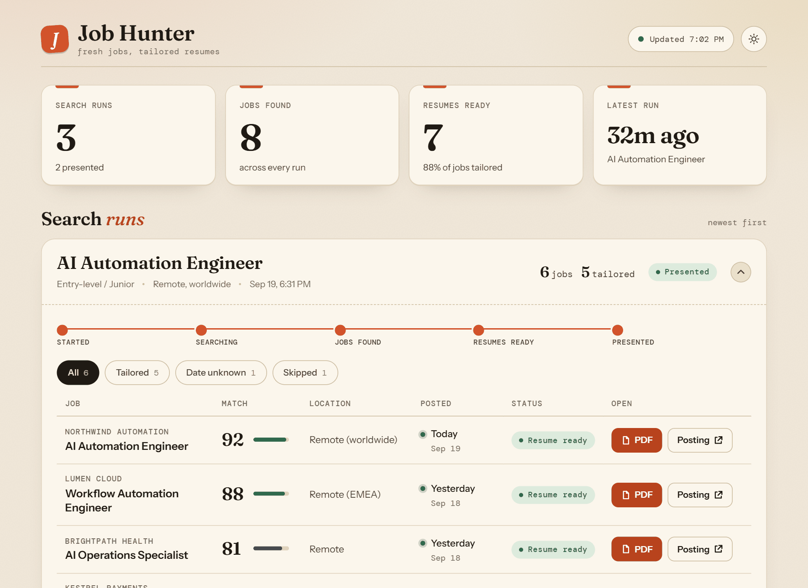
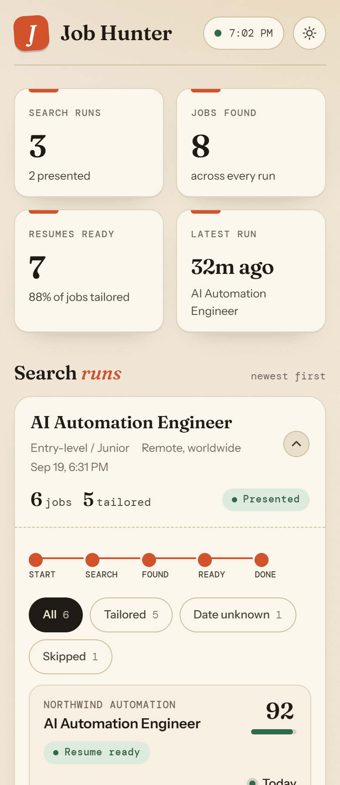
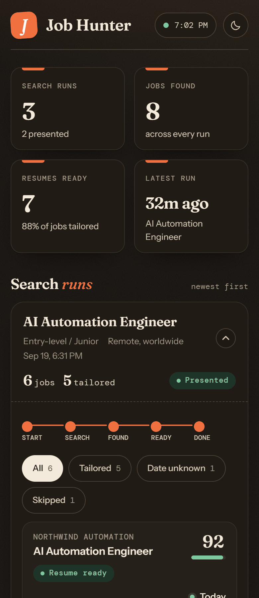

# Job Hunter

Finds fresh jobs straight from company career pages, matches them against your
resume, and tailors a resume PDF for each match, then shows everything on a
local, read-only dashboard. It stops there: no contact extraction, no cover
letter, no applying or emailing for you.



<p align="center">
  
  &nbsp;&nbsp;
  
</p>

_The dashboard with sample data, on a desktop and on a phone (light and dark).
Each run lists its jobs, when they were posted, how well they match, and a link
to the tailored resume PDF._

New here? Read the **[beginner's guide](docs/Job-Hunter-User-Guide.pdf)**. It
explains the workflow in plain language and gives you copy-and-paste prompts for
every step.

## What it does

- **Career pages first.** Jobs come from your target companies' own careers
  pages (including ones hosted on Greenhouse, Lever, Ashby and similar), then
  from other companies' career pages. Job boards like LinkedIn and Indeed are
  never a source.
- **Fresh only.** Only jobs posted in the last **3 days** are kept. Older ones
  are excluded. A job whose posting date can't be verified is kept but flagged
  "date unknown". Change the window in `config/search-config.md`.
- **Tailored resume PDFs that pass ATS.** Your resume is a PDF and so is every
  tailored copy, built to get through applicant tracking systems (see below).
  Nothing is invented: the tailoring only reorders and re-emphasizes what is
  already on your resume, and it asks you for anything missing instead of guessing.
- **Guided first chat.** The first time you chat with the profile, it walks you
  through setup (your resume, the roles you want, your target companies) before
  it does anything else.
- **Read-only dashboard.** A viewer over the database and job folders. It has no
  buttons that change anything.

## Get started

1. **Install [Hermes AI](https://nousresearch.com).** Job Hunter runs as a Hermes
   profile, and the installer can't install Hermes for you.
2. **Run the installer**, from inside this folder:
   - **Windows:** double-click `install.bat`
   - **macOS:** double-click `install.command` (if macOS warns it's from an
     unidentified developer, right-click it and choose **Open** once)
3. **Open a chat with the `job-hunter` profile** (pick it in the Hermes app, or
   run `hermes -p job-hunter chat`) and say hi. It walks you through setup.
4. When it's done, say **"Find jobs for me."**

If chat shows an inference error, type `/model` and pick any available model,
free tiers included.

The installer is safe to re-run any time. It only fills in what's missing and
never touches your resume, config or job history. What it does:

- Installs Python if it's missing (`winget` on Windows, `brew` on macOS).
- Creates the `job-hunter` Hermes profile and points it at this folder.
- Copies a working model setting from your existing Hermes profile, when it can.
- Installs the `onboarding`, `job-finder`, `resume-editor` and
  `resume-pdf-designer` skills and the profile's persona (`hermes-skills/`).
- Checks this machine can read and make PDFs.
- Creates `.env` and the database.
- Creates the daily search job, **paused**.

## Resumes that pass ATS

Most employers run resumes through an applicant tracking system (ATS) before a
person sees them. A pretty resume can fail it: columns get read in the wrong
order, icons and photos vanish, and text drawn as a picture is invisible. So
every tailored resume is made by the `resume-pdf-designer` skill (adapted from
Hermes' `pdf-designer` skill) and `scripts/resume-build.py`:

- **A fixed, ATS-safe design.** One left-aligned column, Arial, standard headings
  (Professional Summary, Skills, Experience, Projects, Education, Certifications),
  company, place and dates on one line, contact details in the body, plain
  hyphens. No tables, icons, images, columns, headers or footers. One subtle
  accent colour on your name and headings (change it in `config/author-profile.md`).
- **It asks before it tailors.** Your phone number with the country code, City and
  Country, and a start and end month for every job are what an ATS needs. If your
  resume doesn't have them, the chat asks you, one question at a time, and saves
  the answers in `resume-library/ats-profile.md` (private, never pushed).
- **It checks its own work.** After building, `scripts/pdf-tools.py ats-check`
  reads the PDF back the way an ATS does and reports anything that would trip a
  parser: no readable text, images, columns, garbled symbols, missing contact
  details or headings, more than two pages, and which job keywords are missing.
  The chat fixes what it flags and rebuilds, and is told never to save a resume
  that still fails.
- **One page, two at most.**

You can also run the pieces yourself:

```
python scripts/pdf-tools.py ats-check resume-library/resume.pdf --base
python scripts/pdf-tools.py ats-check jobs/3-acme/resume.pdf --keywords "python,sql"
```

## The dashboard

Ask in chat: **"Start the dashboard."** It opens at http://127.0.0.1:5301/ and
refreshes every 15 seconds. **"Stop the dashboard."** switches it off.

What's on the page:

- **Summary tiles:** runs, jobs found, resumes ready, and when the latest run was.
- **One card per run**, newest first (the newest opens by itself), with a
  progress line from Started to Presented and, if a run failed or found nothing,
  the reason.
- **Jobs** sorted by match score, each with how fresh it is (Today, Yesterday, or
  "Date unknown"), a status, a **PDF** button for the tailored resume and a link
  to the original posting. Filters appear when a run has more than a few jobs.
- **Responsive:** a table on wide screens, easy-to-tap cards on phones (checked
  from 320px up), with a light and a dark theme that follows your system (the
  round button switches it).

It only listens on your own computer (`127.0.0.1`), so a phone on your network
can't open it. Everything it needs, including its fonts, ships in this folder,
so it works offline.

Or from a terminal, in this folder:

```
python scripts/dashboard-ctl.py start --open
python scripts/dashboard-ctl.py stop
python scripts/dashboard-ctl.py status
```

## The daily search (optional)

The installer creates a job named "Job Hunter Daily Search" (08:00 every day) in
a **paused** state. Ask in chat to turn it on or off ("Turn on my daily job
search."). It only fires while the Hermes gateway is running.

## How it works

```
new -> researching -> jobs_found -> resume_ready -> presented
```

`rejected` and `failed` are side exits. There is no approval or send step,
because nothing is ever sent; `presented` is the end.

1. **Research** (`job-finder` skill). Reads your resume PDF, visits each company
   in `config/target-companies.md`, keeps jobs posted within the freshness
   window, scores each against your resume, and logs it with
   `python scripts/db.py add-job`. `add-job` itself refuses anything older than
   the window, so this doesn't depend on the model behaving.
2. **Tailor** (`resume-editor` and `resume-pdf-designer` skills). For each job
   you choose, tailors your resume as an ATS-safe PDF and saves `jobs/<id>-<company>/resume.pdf` (plus `job-posting.json`
   and `match-notes.md`).

The database (`data/job-hunter.db`) is an index; the `jobs/` folders are the
truth. `scripts/db.py` is the only thing that writes to the database.

## Configuration

| File | What it holds |
| --- | --- |
| `config/search-config.md` | Roles, seniority, location, the freshness window (`Max job age (days)`), job-source rules |
| `config/target-companies.md` | Companies and their careers-page URLs |
| `config/author-profile.md` | Optional voice and tone for resume wording |
| `resume-library/resume.pdf` | Your resume (git-ignored, private) |
| `resume-library/ats-profile.md` | Details you gave the chat for ATS (phone, location, job months). Git-ignored, private |

The onboarding chat fills these in for you. You can also edit them by hand.

## Project layout

```
install.bat / install.command   one-click setup (Windows / macOS)
dashboard.html                  the read-only viewer
scripts/
  db.py                         database CLI, the only writer
  dashboard-server.py           GET-only server behind the dashboard
  dashboard-ctl.py              start / stop / status for the dashboard
  check-setup.py                is setup finished? (used by the first-chat gate)
  pdf-tools.py                  read and make PDFs, with fallbacks; ats-check
  resume-build.py               builds an ATS-safe resume PDF from JSON
  setup-hermes-profile.py       what the installer runs
assets/fonts/                   the dashboard's fonts (open licences, see LICENSES.txt)
hermes-skills/                  persona + the four skills the profile uses
config/                         your settings
resume-library/                 your resume PDF and ATS details (both private)
jobs/                           generated per-job folders (git-ignored)
docs/                           the beginner's guide and the screenshots
tests/                          unit tests
```

## Requirements

- Python 3 (standard library only for the core scripts; the installer gets it
  for you).
- Hermes AI.
- A way to make PDFs: Google Chrome or Microsoft Edge is enough. Alternatively
  `pip install weasyprint`. To read your resume PDF: `pip install pypdf` if the
  installer says no reader was found. (The ATS layout check also uses
  `pip install pymupdf` when present, and is limited without it.)
- A free local port, **5301** (the dashboard binds to `127.0.0.1` only).

## Tests

```
python -m unittest discover -s tests
```

## Privacy

Your resume, generated job folders, database and `.env` are all git-ignored, so
they can't be committed or pushed by accident. The dashboard only listens on
your own machine.
